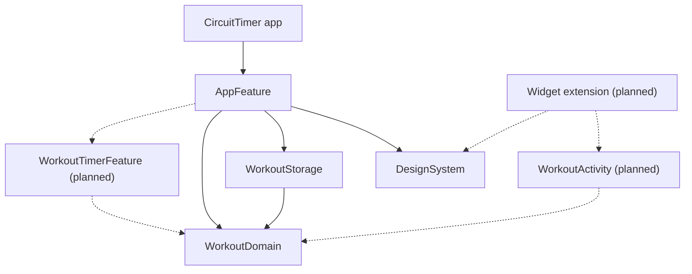

# CircuitTimer

[](https://github.com/akrementsov/CircuitTimer/actions/workflows/ci.yml)

An interval and circuit training timer for iPhone, in active development. A workout is a warm-up, a training block repeated for several rounds and a cool-down, each made of timed work and rest stages, with optional manual pauses in between. The foundation — the domain, the timer engine and the app shell — is in place; the timer screen and the editor come next (see the roadmap).

The repository is also a showcase of how I build iOS apps: a small domain core with explicit contracts, TCA features on top, and tooling that keeps every commit green.

## Stack

- Swift 6 language mode with complete strict concurrency, iOS 17+
- SwiftUI and [The Composable Architecture](https://github.com/pointfreeco/swift-composable-architecture) 1.26 with the 2.0 deprecations trait enabled
- [swift-dependencies](https://github.com/pointfreeco/swift-dependencies) for every side effect
- Swift Testing
- SwiftLint, GitHub Actions
- Xcode 26.5

## Architecture

All code lives in one local Swift package, `CircuitTimerKit`. The Xcode project is a thin shell that only launches `AppFeature`.



| Module | Responsibility |
|---|---|
| `WorkoutDomain` | Workout model, normalization limits, the linear schedule and the `WorkoutRun` timer engine. Foundation only, so the widget can use it. |
| `DesignSystem` | Spacing, radius, typography and color tokens. Lint rejects literal styles anywhere else. |
| `WorkoutStorage` | `WorkoutStorageClient`, a struct-of-closures dependency backed by SwiftData; in memory for previews. |
| `AppFeature` | The root TCA feature: loading, list, empty and retryable error states. |

Features never import each other and the domain never imports TCA or SwiftUI. The full set of conventions is in [AGENTS.md](AGENTS.md).

## The timer engine

`WorkoutRun` does not count ticks. It stores the schedule position reached at an anchor date and derives everything else from the time passed into each call:

- irregular or missed UI updates add no error; the position stays within about a millisecond of real time;
- after an hour in the background one call lands on the right stage — or on the first manual pause, which always waits for the user;
- every transition is a value-type mutation, so the whole contract is unit-testable without clocks or a UI.

The contract — a phase × operation table, nine invariants, the snapshot projection and the time rules — is written down in [docs/timer-engine.md](docs/timer-engine.md). Time is kept in whole milliseconds, and `TimeMath` is the only place that converts between `Date` and `Duration`.

### Clock changes

The engine works on wall-clock time because only a date survives an app restart and drives a Live Activity countdown.

- **Clock moved back:** the timer does not stall and committed progress is kept. If the clock goes back past the anchor the run re-anchors at the current time, and `rebase(at:keepingTotalElapsed:)` lets the UI restore the progress it has already shown.
- **Clock moved forward:** this is an accepted compromise. The run cannot tell it apart from time spent in the background, so it advances through timed stages up to the next manual pause.

## Getting started

```sh
open CircuitTimer.xcodeproj
```

Command line, with [SwiftLint](https://github.com/realm/SwiftLint) on `PATH` and `jq` available:

| Command | What it does |
|---|---|
| `make lint` | SwiftLint in strict mode |
| `make test` | Builds and tests the package with warnings as errors |
| `make build-app` | Builds the app for the simulator |
| `make ci` | Everything CI runs |
| `make verify-clean` | Runs `make ci` on a fresh clone of `HEAD` |

## Roadmap

- [x] **CT-1 Foundation** — package, domain model, schedule, timer engine, design tokens, root feature, lint and CI
- [ ] **Delivery** — TestFlight builds from GitHub Actions
- [ ] **CT-2** — workout list and editor, SwiftData persistence
- [ ] **CT-3** — timer screen, background audio, haptics and spoken stage names
- [ ] **CT-4** — Live Activity and Dynamic Island
- [ ] **CT-5** — iCloud sync
- [ ] **CT-6** — in-app purchase with StoreKit 2
- [ ] **CT-7** — App Store release

## License

© Andrey Krementsov. All rights reserved. The code is published for review purposes only; no license to use, copy or distribute it is granted.
